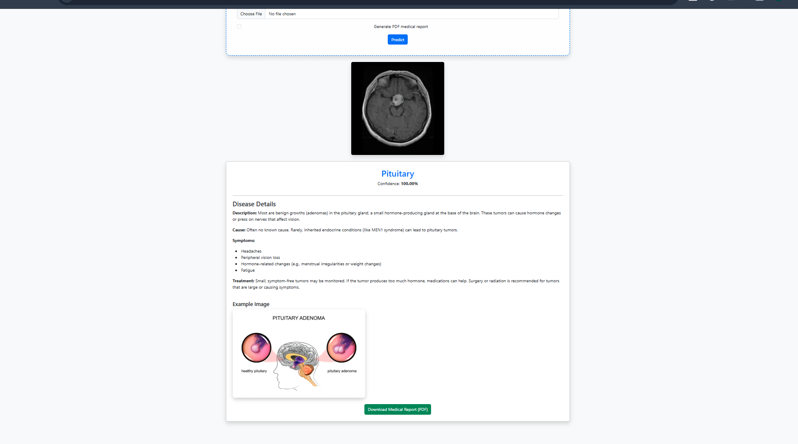
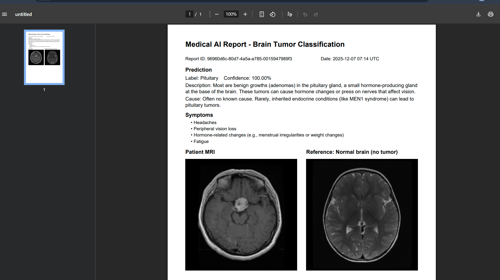

# Brain Tumor Classification (Glioma | Meningioma | Pituitary | No Tumor)
[](#results)

EfficientNet-B2 classifier with a Flask UI for MRI-based tumor triage. Upload an MRI, view the predicted class, confidence, disease info, and download a PDF report with a healthy-reference image.

## Results
- Test accuracy: **98%** on held-out BT MRI test split.
- Model: EfficientNet-B2 (ImageNet init) with two-stage fine-tune (10 frozen epochs, then 40 unfrozen).
- Dataset: ~7k MRIs across Training/Testing folders.

## Demo Media



<video src="results/video.mp4" controls width="720"></video>

## Features
- Drag-and-drop MRI upload in the browser, confidence score, and disease details.
- PDF report (ReportLab) with prediction, description, causes, symptoms, and healthy-reference image.
- Normal reference image is bundled at `app/static/disease_examples/normal_brain_mri.jpg`.
- MLOps stubs present (`constants`, ingestion/validation/transformation/trainer), plus Docker/GitHub Actions roadmap.

## Quickstart (Environment)
```
conda create -n brain_tumor python=3.10 -y
conda activate brain_tumor
pip install -r requirements.txt
```

## Train (Notebook)
1. Open `notebooks/brain_tumor_classification_using_CNN.ipynb` (Colab-friendly).
2. Mount dataset to `/content/data/BT_MRI_Dataset/BT_MRI_Dataset`.
3. Run generators → build EfficientNet-B2 → stage-1 + stage-2 training → evaluation.
4. Save `final_effnetb2.h5` to `app/models/`.

## Run Inference (Flask)
```
cd app
set FLASK_APP=flask_app.py
python flask_app.py
# visit http://127.0.0.1:5000
```

## Project Structure
```
BRAIN-TUMOR-CLASSIFICATION/
├── app/ (Flask app, templates, static, models/)
├── config/ (schema/model configs)
├── notebooks/ (training notebook)
├── src/ (pipeline modules: ingestion, validation, transformation, trainer, etc.)
├── artifact/ (pipeline outputs, gitignored)
├── models/ (final_effnetb2.h5, label_map.json)
├── requirements.txt
├── template.py
└── README.md
```