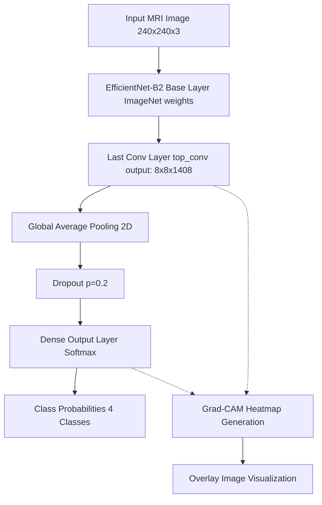

# 🧠 Brain Tumor Classification & Triage System

[](https://www.python.org/)
[](https://www.tensorflow.org/)
[](https://flask.palletsprojects.com/)
[](https://opensource.org/licenses/MIT)
[](#results--evaluation)

An end-to-end medical AI imaging project that leverages a fine-tuned **EfficientNet-B2** model to classify brain MRI scans. The application features an interactive **Flask-based web interface** with drag-and-drop capability, real-time predictions, light/dark mode toggling, and automated **ReportLab PDF medical report generation** complete with a healthy reference image.

---

## 🔍 Key Features

- **High-Accuracy Deep Learning Classifier**: Fine-tuned EfficientNet-B2 achieving **98% classification accuracy** on test data.
- **Multi-Class Detection**: Detects and categorizes MRIs into four distinct states:
  - 🔴 **Glioma**
  - 🟡 **Meningioma**
  - 🔵 **Pituitary**
  - 🟢 **No Tumor** (Healthy reference scan)
- **Interactive Flask Web Application**:
  - **Drag-and-Drop** MRI upload interface with immediate preview.
  - Interactive **Light/Dark Mode** theme toggle.
  - Dynamic prediction loading spinners.
- **Automated PDF Report Generation**: 
  - Instantly generates clinical reports featuring prediction labels, confidence scores, and disease symptoms/descriptions.
  - Side-by-side comparison of the patient's MRI scan with a **normal brain reference MRI**.
- **Jupyter Notebook**: Clean training script with stage-by-stage learning rate schedules and model evaluation plots.

---

## 🖥️ User Interface & Demos

### 1. Main Dashboard (Light & Dark Theme)
The application provides a seamless, modern layout with a clean responsive grid and interactive drop zones.

|  Home page | Result |
| --- | --- |
|  |  |

### 2. Clinical PDF Reports
Generate and download diagnostic-ready medical reports automatically detailing classification results, clinical symptoms, and a reference comparison.

<div align="center">
  
</div>

### 3. Application Walkthrough
Watch the system analyze scan files in real-time.

<div align="center">
  
</div>

---

## 📁 Project Structure

```text
BRAIN-TUMOR-CLASSIFICATION/
├── app/
│   ├── models/
│   │   ├── final_effnetb2.h5       # Fine-tuned EfficientNet-B2 weights (gitignored)
│   │   └── label_map.json          # Index-to-label mapping dictionary
│   ├── static/
│   │   ├── disease_examples/       # Healthy reference image & disease samples
│   │   └── uploads/                # Temporary user-uploaded scans & generated PDFs
│   ├── templates/
│   │   └── index.html              # Frontend bootstrap layout with dark mode script
│   └── flask_app.py                # Main Flask application and PDF generator logic
├── notebooks/
│   └── brain_tumor_classification_using_CNN.ipynb  # End-to-end train & evaluation notebook
├── results/
│   ├── img1.png                # Light-mode screenshot
│   ├── img2.png                # Dark-mode screenshot
│   ├── img33.png               # PDF report preview
│   └── video.gif               # Animated walkthrough
├── .gitignore                  # Git exclusions (data, large model weights, etc.)
├── LICENSE                     # MIT license details
├── requirements.txt            # Project dependencies list
└── README.md                   # Project documentation
```

---

## ⚙️ Installation & Setup

Follow these steps to run the project locally on your system:

### 1. Clone the Repository
```bash
git clone https://github.com/YeshwanthDandu180903/BRAIN-TUMOR-CLASSIFICATION.git
cd BRAIN-TUMOR-CLASSIFICATION
```

### 2. Setup Virtual Environment
We recommend using **Conda** or **venv** with Python 3.10:

**Using Conda:**
```bash
conda create -n brain_tumor python=3.10 -y
conda activate brain_tumor
```

**Using venv:**
```bash
python -m venv venv
# On Windows
venv\Scripts\activate
# On macOS/Linux
source venv/bin/activate
```

### 3. Install Dependencies
```bash
pip install --upgrade pip
pip install -r requirements.txt
```

---

## 🚀 Usage Guide

### Running the Web Application
1. Start the Flask application by running:
   ```bash
   cd app
   python flask_app.py
   ```
2. Open your web browser and go to:
   ```text
   http://127.0.0.1:5000/
   ```
3. Drag and drop a brain MRI scan image (supported formats: `.png`, `.jpg`, `.jpeg`), check **Generate PDF medical report**, and click **Predict** to view results.

### Training the Model
If you want to retrain the model on your dataset:
1. Open the Jupyter Notebook located at:
   ```text
   notebooks/brain_tumor_classification_using_CNN.ipynb
   ```
2. Download or map the dataset (expected shape: folders matching `Training` and `Testing` containing sub-directories for each class).
3. Run through the notebook cells to ingest data, execute transfer learning (EfficientNet-B2 base + custom dense layers), fine-tune the model, and export the `.h5` model file.
4. Save the generated `final_effnetb2.h5` file inside `app/models/`.

---

## 🧬 Model Architecture & Mathematical Foundations

To classify brain MRI scans with high precision, this project utilizes a combination of a transfer-learning-based feature extractor and a custom classification head. The decision-making process is explained visually using Grad-CAM.


```mermaid
graph TD
    A[Input MRI Image 240x240x3] --> B[EfficientNet-B2 Base Layer ImageNet weights]
    B --> C[Last Conv Layer top_conv output: 8x8x1408]
    C --> D[Global Average Pooling 2D]
    D --> E[Dropout p=0.2]
    E --> F[Dense Output Layer Softmax]
    F --> G[Class Probabilities 4 Classes]
    
    C -.-> H[Grad-CAM Heatmap Generation]
    F -.-> H
    H --> I[Overlay Image Visualization]
```

### 1. Feature Extraction: EfficientNet-B2 Base
The model uses **EfficientNet-B2** initialized with pre-trained ImageNet weights. EfficientNet uses a **compound scaling** method that scales network depth ($d$), width ($w$), and resolution ($r$) uniformly using a compound coefficient $\phi$:

$$d = \alpha^\phi, \quad w = \beta^\phi, \quad r = \gamma^\phi$$

$$\text{subject to } \alpha \cdot \beta^2 \cdot \gamma^2 \approx 2 \quad \text{and} \quad \alpha \ge 1, \beta \ge 1, \gamma \ge 1$$

where $\alpha, \beta, \gamma$ are constant coefficients determined by a small grid search on the baseline network. For EfficientNet-B2, these scaling factors optimize feature extraction from the input image dimension of $240 \times 240 \times 3$ pixels.

### 2. Custom Classification Head
The extracted convolutional feature map $F \in \mathbb{R}^{H \times W \times C}$ (where $H=8$, $W=8$, and $C=1408$ for B2 at this resolution) is passed through custom classification layers:

1. **Global Average Pooling (GAP)**: Reduces the feature map spatial dimensions to a 1D vector $v \in \mathbb{R}^C$ by averaging pixel values across each channel:
   $$v_c = \frac{1}{H \times W} \sum_{i=1}^H \sum_{j=1}^W F_{i,j,c}$$

2. **Dropout Regularization**: Prevents overfitting by randomly zeroing out elements of the GAP output with a probability $p = 0.2$ during training:
   $$\tilde{v} = v \odot m, \quad m_c \sim \text{Bernoulli}(1-p)$$

3. **Dense Layer & Softmax Activation**: Computes the raw logits $z = W\tilde{v} + b$ and maps them to a probability distribution $\hat{y}$ over $K = 4$ classes:
   $$\hat{y}_c = \text{Softmax}(z)_c = \frac{e^{z_c}}{\sum_{j=1}^{K} e^{z_j}}$$
   where $c \in \{ \text{Glioma}, \text{Meningioma}, \text{Pituitary}, \text{No Tumor} \}$.

### 3. Optimization & Training Loss
During training, parameters are optimized using the **Categorical Cross-Entropy Loss**:

$$\mathcal{L} = -\sum_{c=1}^{K} y_c \log(\hat{y}_c)$$

where $y_c$ is the binary ground-truth label (one-hot encoded) and $\hat{y}_c$ is the predicted probability for class $c$.

The parameters $\theta = \{W, b, \dots\}$ are updated using the **Adam Optimizer**, which calculates adaptive learning rates for each parameter based on estimates of first and second moments of the gradients:

$$m_t = \beta_1 m_{t-1} + (1 - \beta_1) g_t$$
$$v_t = \beta_2 v_{t-1} + (1 - \beta_2) g_t^2$$
$$\hat{m}_t = \frac{m_t}{1 - \beta_1^t}, \quad \hat{v}_t = \frac{v_t}{1 - \beta_2^t}$$
$$\theta_t = \theta_{t-1} - \frac{\eta}{\sqrt{\hat{v}_t} + \epsilon} \hat{m}_t$$

where:
- $g_t = \nabla_\theta \mathcal{L}_t$ is the gradient at step $t$
- $\eta$ is the learning rate (initially $0.001$, dynamically scaled by `ReduceLROnPlateau` by $0.3$ on plateau)
- $\beta_1 = 0.9$ and $\beta_2 = 0.999$ are exponential decay rates for moment estimates
- $\epsilon = 10^{-7}$ is a small scalar to prevent division by zero

### 4. Explainable AI: Grad-CAM
To provide visual explanations of model decisions, **Gradient-Weighted Class Activation Mapping (Grad-CAM)** is used. Let $A^k$ represent the activation map of channel $k$ in the final convolutional layer of the model (here, `top_conv`).

1. **Gradient Computation**: Compute the gradient of the score for class $c$, $y^c$ (before softmax), with respect to the activation maps $A^k$:
   $$\frac{\partial y^c}{\partial A^k}$$

2. **Neuron Importance Weights**: Compute the channel-wise importance weight $\alpha_k^c$ using global average pooling:
   $$\alpha_k^c = \frac{1}{Z} \sum_{i=1}^H \sum_{j=1}^W \frac{\partial y^c}{\partial A_{i,j}^k}$$
   where $Z = H \times W$ is the spatial area of the feature map.

3. **Coarse Saliency Map Generation**: Compute a weighted combination of forward activation maps, followed by a ReLU activation to focus only on features that positively influence class $c$:
   $$L_{\text{Grad-CAM}}^c = \text{ReLU}\left( \sum_k \alpha_k^c A^k \right)$$

---

## 📊 Results & Evaluation

The model was trained using transfer learning on `EfficientNet-B2` with ImageNet initialization, utilizing two-stage fine-tuning:
1. **Stage 1 (Feature Extraction)**: 10 epochs training head classifiers only with base layers frozen.
2. **Stage 2 (Fine-tuning)**: 40 epochs with all layers unfrozen and a low learning rate.

### Performance metrics on held-out test split:
- **Test Accuracy**: **98%**
- **Robustness**: High confidence classification across tumor categories (Glioma, Meningioma, Pituitary) and clean brain scans (No Tumor).

---

## 📄 License

This project is licensed under the MIT License - see the [LICENSE](LICENSE) file for details.

---

## 🤝 Contact & Contribution

For questions, issues, or contributions, please contact:
- **Author**: Dandu Yeshwanth
- **GitHub**: [@YeshwanthDandu180903](https://github.com/YeshwanthDandu180903)
- **Project Link**: [Brain Tumor Classification](https://github.com/YeshwanthDandu180903/BRAIN-TUMOR-CLASSIFICATION)

*Disclaimer: This application is a prototype for educational and research purposes and should not be used as a replacement for professional medical diagnosis.*
